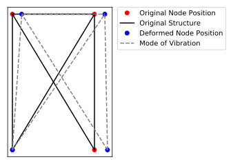

# Abstract

The term project for the functional languages course is creating a structural mode of vibration animator.  For a given structural geometry, the animator will determine what the natural frequencies are, as well as the natural modes of vibration, and then animate them.

# Background

## Structural Components

Every structure has a series of natural frequencies, and with each natural frequency, there is an associated "mode of vibration".  The mode of vibration describes how the structure vibrates at the given frequency.  When strictures vibrate, they usually vibrate in a linear combination of its modes of vibrations.

To better illustrate what a mode of vibration is, look at the figure below.  The solid lines and red dots correspond to the structural members and connecting nodes in the "at rest" position of the structure.  The dashed lines and blue dots correspond to the structure members and connecting nodes at the maximum displacement of the first mode of vibration.



Knowing what excitation frequencies a structure is subjected to, such as knowing the frequency and speed of vehicles driving over bridges, or the types of earthquakes or other seismic activity the building can be subjected to can help structural engineers know to keep the natural frequencies of a structure far removed from the excitation frequencies that it could be subjected to.

## Numerical Simplifications

For numerical simplicity, this project assumes the structure is a planar truss structure.  Planar indicates that the structure is only two dimensional.  Truss implies all the structural members are subjected only to compression and tension, and not to any kind of bending forces.  Doing the calculation for 3-dimensional structures is only trivially more difficult, however animating would be far more difficult as we would need an image library that could provide depth perception to a set of 3D coordinates.

The truss simplification of a beam is a much larger difference.  Doing a similar calculation with beams would require significant computational resources, and lots of approximations using finite element theory.  Such a project would be well outside the scope of this work.

## Motivation

When the project was presented to the class, one of the suggestions provided by Professor Tolmach was to pick a project that one would feel comfortable doing in another language, but may be a challenge using functional methods.  This project is something I had in mind using Python some time ago, however I never had; so I thought this would be a good topic for a project.

Furthermore, I wanted to learn about packaging in Haskell.  It was a goal of mine to have my project be deployable via standard tools.

# Features

## Input

I have provided multiple structures to import and test from.  The structure geometry is stored in the following format.

```haskell
list_nodes :: [(Int, (Double, Double))]

-- list_nodes = [(id, (x_pos, y_pos)()]

list_node_fixtures :: [(Int, (Bool, Bool))]

-- list_node_fixtures :: [(id, (x_fixed, y_xied))

list_edges :: [(Int, (Int, Int))]

-- list_edges [(id, (1st_node, 2nd_node))]

elastic_mod = 400000000.0 :: Double
rho = 7850.0 :: Double
cross_sec_area = 0.04361282 :: Double
```

Some considerations, and should there be future work on this project, these would be addressed.

The `list_nodes` list, must have sequential $id$s starting from 1.  The doubles that are associated with each $id$ are the x coordinate and the y coordinate for that given node.  

The `list_node_fixtures` list contains a list of nodes that have at least one constraint.  If the first element in the pair is `True` that means that that code is constrained in the x-direction (cannot move), if the second element of the pair is `True` then that node is constrained in the y-direction.

The `list_edges` variable contains a list of pairs, where the $id$ does not matter, provided that each edge's $id$ is unique.  Each entry in that list, has a pair that contains the two nodes each edge contains.

Lastly, the `elastic_mod` corresponds to the Elastic modulus of the material used, `rho` is the density of the material used, and `cross_sec_area` is the cross-sectional area for the beam.  This program assumes that all members have the same properties here, any future work would likely associate these properties on a per-edge basis.  The numbers I have given are typical of structural grade steel with a very large structural beam.

Multiple structure geometry files are provided, along with their associated fixtures.  Feel free to modify or create your own.

## Installation

```bash
# Install Haskell stack dependencies
sudo apt-get install g++ gcc libc6-dev libffi-dev libgmp-dev make xz-utils zlib1g-dev git gnupg

# Install the Haskell Stack on Linux
wget -qO- https://get.haskellstack.org/ | sh

# LAPACK and BLAS needed for hmatrix dependency
sudo apt-get install libblas-dev liblapack-dev

git clone git@github.com:j9ac9k/mode-of-vibration-animator.git
cd mode-of-vibration-animator
stack build
```

To run the program

```bash
stack exec vibration-animator
```

# Customization

As stated earlier, the parameters can be altered, and provided the structural geometry makes sense, and the structure is not over or under-constrained, it will display the associated mode of vibration.

# Problem Specifics

## Eigenvalues and Eigenvectors

This program solves the following problem.

$$
[K - \omega ^2 M ] \lambda = 0
$$

Where $K$ is the stiffness matrix, $M$ is the mass matrix.  $\lambda$ is the eigenvector that corresponds to the n'th mode of vibration, and the n'th natural frequency is $f_n = \frac{\omega_n}{2\pi}$

There are many possibilities for $\omega^2$ and $\lambda$ that would satisfy this equation, and each combination of the two correspond to a natural frequency and associated mode of vibration.

Once I have the $\lambda$ vectors, I can add each of the vectors to the position of each node in my structure, and that will show how the vibration will deform at the associated $\omega$ eigenvalue.

## Mass and Stiffness Matrices

The mass $M$ and stiffness $K$ matrices are the super-position of each structural member.

$$
k_e = \frac{EA}{L}  \begin{pmatrix}
1 & 0 & -1 & 0\\
0 & 0 & 0 & 0\\
-1 & 0 & 1 & 0\\
0 & 0 & 0 & 0
\end{pmatrix}
$$

Where $E$ is the elastic modulus of the material, $A$ is the cross sectional area, and $L$ is the length of the truss.

$$
m_e = \frac{\rho A L}{6} \begin{pmatrix}
2 & 0 & 1 & 0 \\
0 & 2 & 0 & 1 \\
1 & 0 & 2 & 0 \\
0 & 1 & 0 & 2
\end{pmatrix}
$$

Where $\rho$ is the density of the material, and $A$ is the cross-sectional area, and $L$ is the length.

$M$ and $K$ are referred to as _global_ matrices, where all the matrices from each element are super-positioned onto one another.  The form of the global matrix is where the first row and column corresponds to the x-axis of the first node, the second row and column correspond to the y-axis of the first node, the third row and column correspond to the x-axis of the second node, and so on.

When the global matrices is constructed, then the rows and columns corresponding to the fixed nodes must be removed.  If node 1 has both x and y constrained, and node 2 has y only constrained, then I would need to remove the first, second and fourth rows and columns from both global matrices.  

After we calculate the eigenvalues, we must insert zeros into those indices so we can render the animation correctly.

## Animating the Vibration

The vibration is animated using the Gloss library for Haskell.  The animation is generated by creating a line between each vertex in the structure and then moving those vertices along the x-y plane based on the values passed from `Constructor.hs`.  A sine function is used to simulate how things vibrate in the real world.

The following variables in the `Animator.hs` files control the different ways in which the animation can be customized.

### Animation Appearance Parameters

`width`

:    the width of the display window

`height`

:    the height of the window

`winLoc`

:    the window will be placed this many pixels from the top and left edges of the screen

`speed`

:    the rate at which the animation vibrates

`amplitude`  

:    the amplitude at which the vibration is exaggerated in the animation

`trussColor`

:    the color of the structure

`freqColor`  

:    the color of the text display for the frequency

`background`

:    the color of the background

### Animation Structure Placement Parameters

`leftShift`

:    the left offset of the structure from the window

`topShift`

:   the top offset of the structure from the window

`scale`

:    the ratio of the scaling of the object to fit in the window

### Functions That Generate The Animation

`start_animation`

:   calls the functions that create the window, structure and starts the animation

`createTruss`

:   calls the function that create the structure and freq display, then makes them into one picture to display and scales it

`createPictures`

:   maps the function to turn a pair of vertexes into a line over the list of edges and appends the freq display to that list

`createText`

:   creates the freq display

`createLinetakes`

:   in a pair of vertices and returns a picture of a line between the vertices

`getPointLoc`

:   finds the current x-y location of the vertices based on the values from the constructor and time
